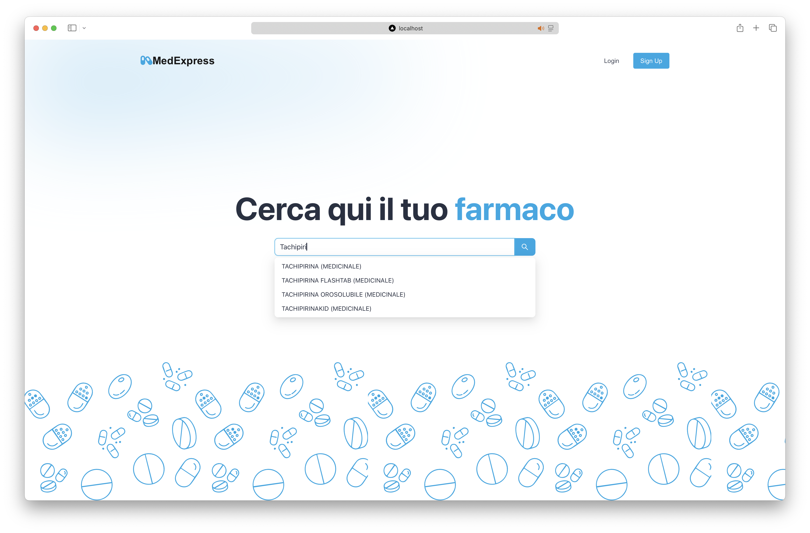
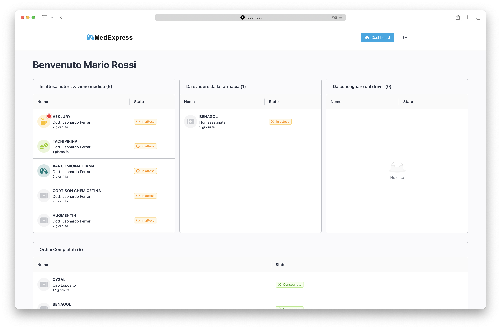

# Learn : MedExpress

This document explains the purpose of the MedExpress project, how to run it, and the technologies used.

---

## 1. Overview

**MedExpress** is a university project designed to streamline drug delivery and pharmaceutical communication between patients, doctors, pharmacies, and drivers.
It is developed using Java and Spring Boot on the backend, with a modern frontend built using React and Next.js.

The system supports authentication, order management, prescription workflows, and live updates through WebSockets.

---

## 2. Key Components

### a. Backend: Spring Boot

* Built with **Java 21** and **Spring Boot 3.4.2**.
* Uses **MongoDB** for storing data and **Maven** for dependency management.
* RESTful services expose core functionality.
* Real-time features are supported using **Socket.io**.
* Authentication is managed using **JWT** and **Spring Security**.

### b. Frontend: Next.js & React

* Developed with **React 19** and **Next.js 15**.
* UI styled with **TailwindCSS** and **Ant Design**.
* API requests are handled via **Axios**.
* Uses **TypeScript** and **Lodash** for robust development.

### c. Environment & Build Tools

* Project configuration is managed with **dotenv** for storing secrets and environment variables.
* **Swagger UI** is included for API documentation.
* Testing is handled with **JUnit** and **Reactor Test**.

---

## 3. How It Works

1. The backend is a Spring Boot application that exposes secure REST APIs.
2. MongoDB serves as the NoSQL database for storing users, orders, and drug data.
3. WebSocket connections provide real-time communication (e.g., order tracking).
4. The frontend is built in React and Next.js, consuming backend APIs.
5. JWT-based authentication ensures secure access to protected resources.
6. The frontend provides dashboards for each user type: patient, doctor, pharmacy, and driver.
7. A `.env` file is used to manage secrets (DB URIs, JWT secrets, etc.).

---

## 4. How to Run the Project

### Requirements

* Java 21
* MongoDB installed locally or cloud-based URI
* `.env` file with required configuration (e.g., DB URI, JWT secret)

### Run Backend

1. Download `.jar` from [Releases](https://github.com/giovannimirulla/MedExpress/releases)
2. Execute with:

   ```bash
   java -jar medexpress.jar
   ```

### Run Frontend

1. Go to the frontend directory.
2. Install dependencies:

   ```bash
   npm install
   ```
3. Run the development server:

   ```bash
   npm run dev
   ```

---

## 5. Documentation

* [Swagger UI](http://localhost:8080/swagger-ui/index.html)
* [Detailed PDF Documentation](Documentazione%20MedExpress/Documentazione%20Completa/Documentazione%20Completa.pdf)

---

## 6. Resources

* [Spring Boot Documentation](https://docs.spring.io/spring-boot/)
* [Next.js Documentation](https://nextjs.org/docs)
* [MongoDB Documentation](https://www.mongodb.com/docs/)
* [JWT Introduction](https://jwt.io/introduction)
* [Socket.io Docs](https://socket.io/docs/)
* [TailwindCSS Docs](https://tailwindcss.com/docs)
* [Ant Design Docs](https://ant.design/docs/react/introduce)
* [Swagger OpenAPI](https://swagger.io/docs/)

---

## 7. Screenshots

### Home

<p align="center"></p><br>

### Search Drugs

<p align="center"></p><br>

### Dashboard

<p align="center"></p><br>

### Order Details

<p align="center"></p><br>

---

## 8. Design Patterns

This project implements GRASP and GoF patterns, including:

* **Controller** (e.g. `OrderController`)
* **Information Expert** (e.g. `UserService`)
* **Creator** (e.g. `OrderService`)
* **Singleton** (`ModelMapperConfig`)
* **Observer** (via WebSockets in `SocketIOController`)
* **Strategy** (Order status enums)

See full pattern implementation in the codebase.
