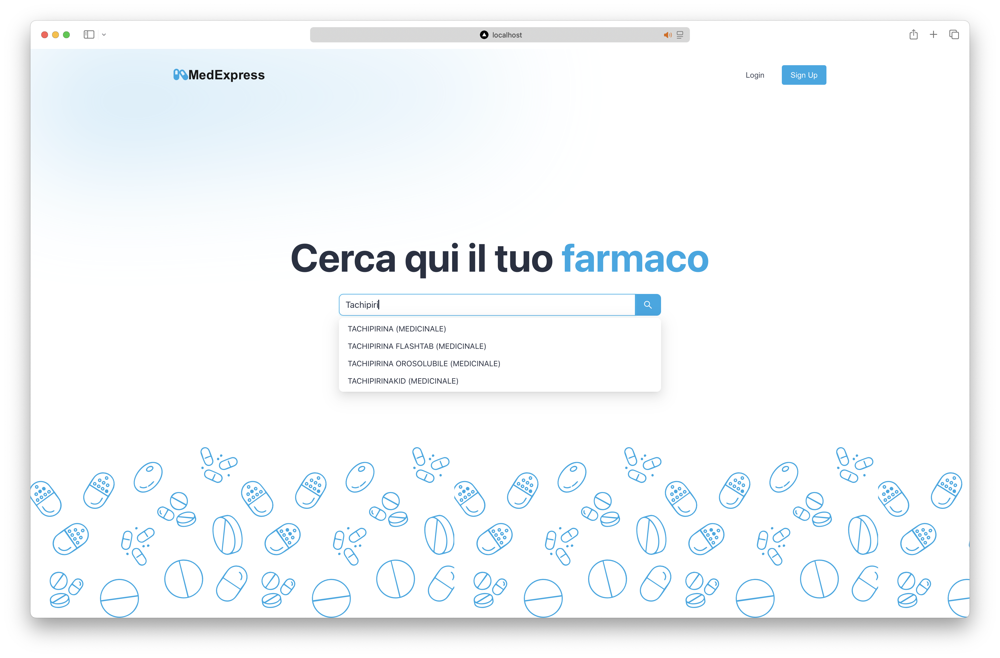
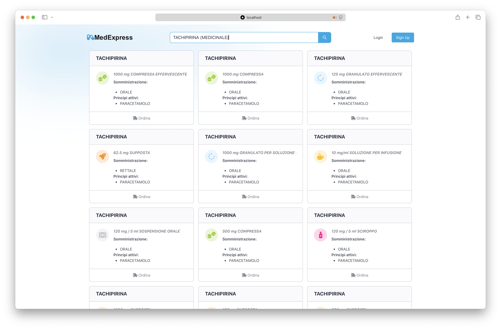
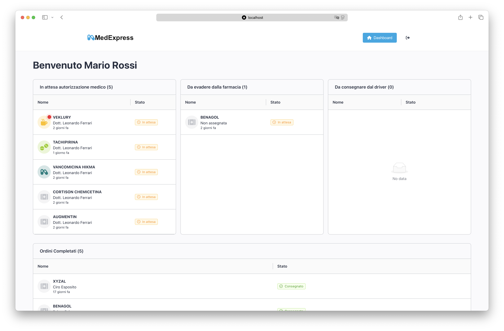
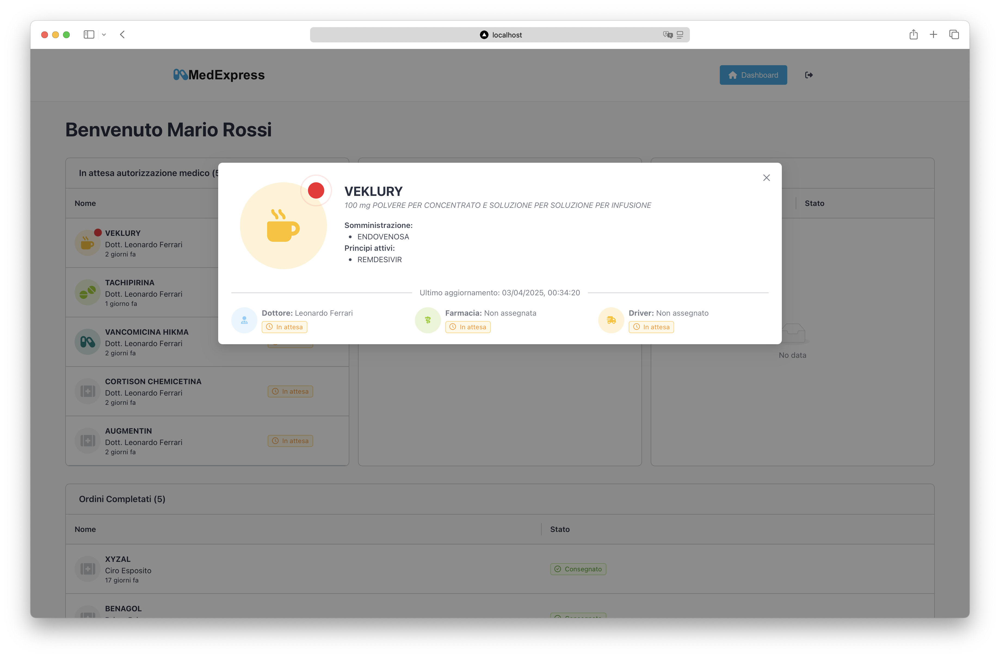

<h1 align="center">MedExpress</h1>

  University Project for Drug Delivery

---

  <!-- Java -->
  
  <!-- Spring Boot -->
  
  <!-- Maven -->
  
  <!-- MongoDB -->
  
  <!-- Socket.io -->
  
  <!-- Tailwind CSS -->
  
  <!-- TypeScript -->
  
  <!-- React -->
  
  <!-- Next.js -->
  
  <!-- Axios -->
  
  <!-- Lodash -->
  
  <!-- Ant Design -->
  
  <!-- FontAwesome -->
  
  <!-- ESLint -->
  
  <!-- JUnit -->
  
  <!-- Reactor Test -->
  
  <!-- Spring Security -->
  
  <!-- JJWT -->
  
  <!-- SpringDoc -->
  
  <!-- dotenv -->
  

 

# How to run the project

### Requirements

- Java 21

### Run the project

1. Download .jar from [MedExpress Releases](https://github.com/giovannimirulla/MedExpress/releases)
2. Run the jar with the command `java -jar <file>.jar`

 

# Test Users

Below are the test users you can use to access the application:

- **Patient**:

  - Email: `patient@gmail.com`
  - Password: `Qwertyuiop123.`

- **Driver**:

  - Email: `driver@gmail.com`
  - Password: `Qwertyuiop123.`

- **Doctor**:

  - Email: `doctor@gmail.com`
  - Password: `Qwertyuiop123.`

- **Pharmacy 1**:

  - Email: `pharmacy1@gmail.com`
  - Password: `Qwertyuiop123.`

- **Pharmacy 2**:
  - Email: `pharmacy2@gmail.com`
  - Password: `Qwertyuiop123.`

# Documentation

For a complete overview of the project, you can refer to the detailed documentation available in PDF format:  
[Detailed Documentation](Documentazione%20MedExpress/Documentazione%20Completa/Documentazione%20Completa.pdf)

# Swagger

The Swagger UI is available at the following URL: [http://localhost:8080/swagger-ui/index.html](http://localhost:8080/swagger-ui/index.html)
 

# Reference Documentation

For further reference, please consider the following sections:

- [Official Apache Maven documentation](https://maven.apache.org/guides/index.html)
- [Spring Boot Maven Plugin Reference Guide](https://docs.spring.io/spring-boot/3.4.2/maven-plugin)
- [Create an OCI image](https://docs.spring.io/spring-boot/3.4.2/maven-plugin/build-image.html)
- [Spring Web](https://docs.spring.io/spring-boot/3.4.2/reference/web/servlet.html)
- [Spring Data MongoDB](https://docs.spring.io/spring-boot/3.4.2/reference/data/nosql.html#data.nosql.mongodb)
- [WebSocket](https://docs.spring.io/spring-boot/3.4.2/reference/messaging/websockets.html)
- [Spring Boot DevTools](https://docs.spring.io/spring-boot/3.4.2/reference/using/devtools.html)

### Guides

The following guides illustrate how to use some features concretely:

- [Building a RESTful Web Service](https://spring.io/guides/gs/rest-service/)
- [Serving Web Content with Spring MVC](https://spring.io/guides/gs/serving-web-content/)
- [Building REST services with Spring](https://spring.io/guides/tutorials/rest/)
- [Accessing Data with MongoDB](https://spring.io/guides/gs/accessing-data-mongodb/)
- [Using WebSocket to build an interactive web application](https://spring.io/guides/gs/messaging-stomp-websocket/)

### Maven Parent overrides

Due to Maven's design, elements are inherited from the parent POM to the project POM.
While most of the inheritance is fine, it also inherits unwanted elements like `<license>` and `<developers>` from the parent.
To prevent this, the project POM contains empty overrides for these elements.
If you manually switch to a different parent and actually want the inheritance, you need to remove those overrides.

 

# Screenshot

### Search drugs

 

### Dashboard

 

### Order details

 

# Design Pattern

### Creational Patterns

1. Singleton :
   - The ModelMapperConfig class uses the @Bean annotation to create a singleton instance of ModelMapper . This ensures that only one instance of ModelMapper is created and shared across the application. - `ModelMapperConfig.java`

### Structural Patterns

1. Facade :
   - The JwtUtil class acts as a facade for JWT operations, providing a simplified interface for generating and validating tokens. - `JwtUtil.java`

### Behavioral Patterns

1. Observer :

   - The SocketIOServer in SocketIOController uses event listeners ( addConnectListener , addDisconnectListener , addEventListener ) which are typical of the Observer pattern, where changes in state are communicated to interested parties. - `SocketIOController.java`

2. Strategy :

   - The Order class uses enums like StatusDoctor , StatusPharmacy , and StatusDriver to define different strategies for handling order statuses. - `Order.java`

    

# To DO

### Uses Cases

- [x] UC1: User Registration - @giovannimirulla
- [x] UC2: Pharmacy Registration - @agatarosselli
- [x] UC3: Search for a drug - @giovannimirulla
- [x] UC4: Order drug - @agatarosselli
- [x] UC5: Request a prescription - @agatarosselli
- [x] UC6: Autorize a prescription - @agatarosselli & @giovannimirulla
- [x] UC7: Communicate authorization status - @agatarosselli & @giovannimirulla
- [x] UC8: Manage evasion and status order registration - @giovannimirulla
- [x] UC9: Take charge of the order - @giovannimirulla
- [x] UC10: Track delivery status - @giovannimirulla
- [x] UC11: Track priority orders - @giovannimirulla

### Frontend

- [x] Home - Search drugs page - @giovannimirulla
- [x] Swagger - @giovannimirulla
- [x] Search drug - @giovannimirulla
- [x] Drug details - @giovannimirulla
- [x] Login - @giovannimirulla
- [x] Sign up pharmacy - @giovannimirulla
- [x] Sign up user - @giovannimirulla
- [x] Order drug - @giovannimirulla
- [x] Dashboard pharmacy - @giovannimirulla
- [x] Dashboard patient - @giovannimirulla
- [x] Dashboard doctor - @giovannimirulla
- [x] Dashboard driver - @giovannimirulla
- [x] Dashboard drugs - @agatarosselli
- [x] Priority - @agatarosselli

### Tests

- [x] UC1 Test - @mariachiara98
- [x] UC2 Test - @mariachiara98
- [x] UC3 Test - @mariachiara98
- [x] UC4 Test - @mariachiara98
- [x] UC5 Test - @mariachiara98
- [x] UC6 Test - @mariachiara98
- [x] UC7 Test - @mariachiara98
- [x] UC8 Test - @mariachiara98
- [x] UC9 Test - @mariachiara98
- [x] UC10 Test - @mariachiara98
- [x] UC11 Test - @mariachiara98
